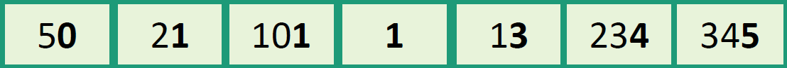
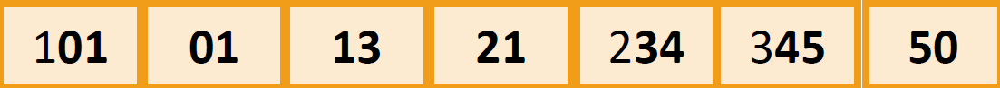
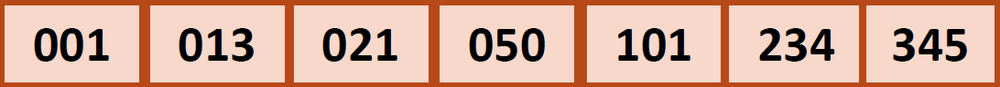

# Radix-Sort
Radix sort in Python lang
<br><br>
## Code
```python
def counting_sort(list, exp):
    bukets = [[] for _ in range(10)]
    for e in list:
        bukets[((e // exp) % 10)].append(e)
    count = 0
    new_list = []
    while count < 10:
        if len(bukets[count]):
            new_list.append(bukets[count].pop(0))
        else: count+=1
    for i in range(len(new_list)): list[i] = new_list[i]

def radix_sort(list):
    max_num = max(list)
    exp = 1
    while max_num // exp > 0:
        counting_sort(list, exp)
        exp *= 10

if __name__ == "__main__":
    nums = [21, 345, 13, 101, 50, 234, 1]
    print(nums)
    radix_sort(nums)
    print(nums)
```
<br><br>
## Example
To understand better, let's start with an example. <br>
Example We want to sort [21, 345, 13, 101, 50, 234, 1] <br>
We arrange digit by digit! <br>
<br> Start from the unit of each number.<br>

<br><br> And now the second unit <br>

<br><br> And the third unit <br>

<br><br>
## Code explanation
We use counting sort for this sort. <br>
The difference is that at each step we use 10 buckets to sort each place value. <br>
And each step we sort a place value. <br>
Each time enumeration sort is called, a place value is sorted.
<br><br>
## Time Complexity
𝑛: Number of elements <br>
𝑘: Total number of digits in each number (or length of the largest number depending on the base) <br>
```
T(n) = O(𝑘 × 𝑛)
```
If the data are numbers up to a maximum value of 𝑀
```
𝑘 = log ₁₀​(M)
```
Example: <br>
𝑛 = [0,..,1000] <br>
M = 999 (log ₁₀​(999) = 2) <br>
𝑘 = 2 <br><br>
T(n) = O(2n) = O(n)
**TIP: For decimal numbers, the base is 10 and for binary, the base is 2.** <br><br>
Result: <br>
```
T(𝑛) = O(log ₁₀​(M) × 𝑛) ≈ O(𝑘 × 𝑛)
```
